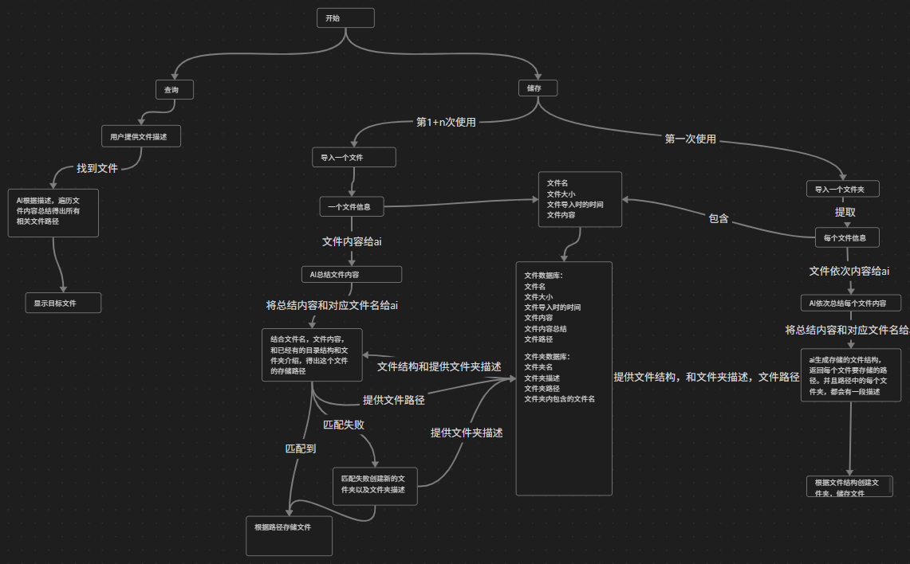

# FileFlow - 智能文件分类工具

## 项目简介

这是一个基于AI的文件分类软件，主要功能包括：  
- 初始文件夹自定义整理  
- 后续添加文件自动归类  
- 自然语言查询匹配  

致力于为用户提供轻松便捷的文档整理解决方案。  

## 应用流程  
  


## 技术栈
- **开发语言**: Python 3.9+  
- **前端框架**: PyQt5  
- **数据库**: SQLite  
- **AI处理**: langchain  

## 项目结构
```
FileFlow
├─ config/        # 初始配置文件
│  └─ IgnoreMe.txt
├─ doc/           # 项目文档
│  └─ IgnoreMe.txt
├─ requirements.txt # 依赖包列表
├─ run_app.py      # 应用启动入口
└─ src/
   ├─ controllers/      # 后端控制逻辑
   │  └─ IgnoreMe.txt
   ├─ controllers_for_ai/ # AI处理逻辑
   │  └─ IgnoreMe.txt   
   ├─ models/       # 数据模型定义
   │  └─ IgnoreMe.txt
   ├─ storage/      # 数据库相关
   │  └─ IgnoreMe.txt
   ├─ ui/           # 前端界面
   │  └─ IgnoreMe.txt
   └─ utils/        # 工具类
      └─ IgnoreMe.txt
```

