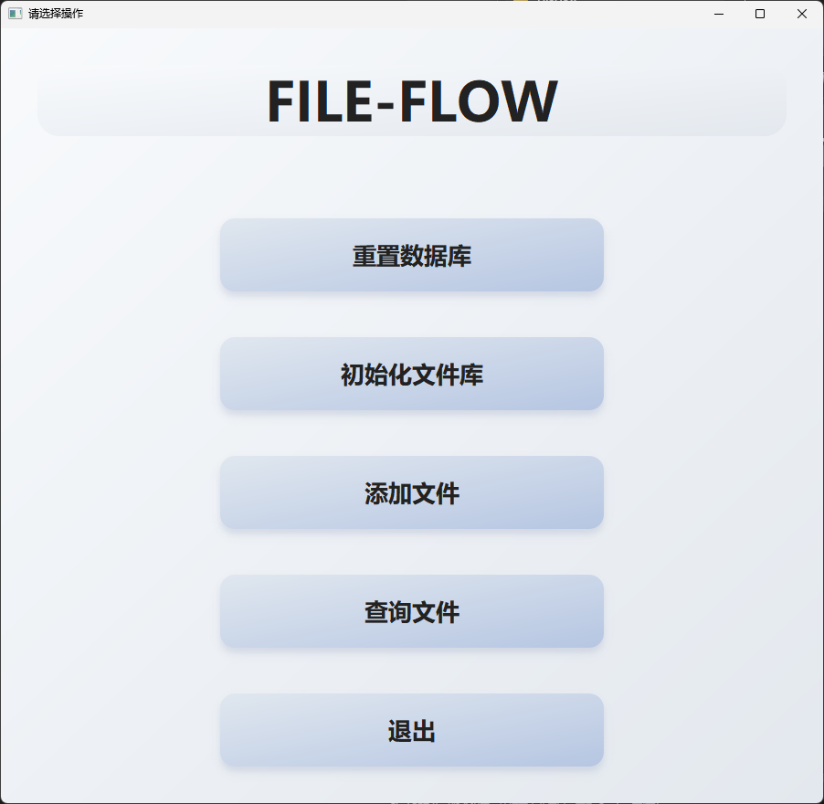

# 📁 FileFlow - 智能文件分类工具

> 本地文档太多太乱？让 FileFlow 帮你一键智能分类整理！
> 
---
## 🚀 项目简介

**FileFlow** 是一款基于AI的智能文件分类工具，支持自动解析、分类本地文件、 自然语言查找等。它适用于学生、办公人员等需要管理大量文档的场景。

- 🧠 内容识别 + 元数据提取，精准理解文档含义
    
- 📂 AI 自动多级分类（如：课程资料、论文、简历、合同等）
    
- 🔄 新文件AI自动归类，无需手动整理
    
- 🔍 自然语言快速查找文件，支持“宿舍相关”等语句
    
- 🖥️ 图形界面支持，简单直观操作

---

## ⚠️ 注意事项

* 当前仅支持 **[DeepSeek API](https://platform.deepseek.com/)**，请先前往申请密钥并填写到配置中
* 每次整理文件建议 **控制在 50 个以内**，避免超过模型输出限制引发错误
* AI 返回的路径经过处理为相对路径再进行拼接优化，以限制文件移动，但**建议重要文件先备份后再操作**，以防误删或替换

---

## 📸 项目演示
### [FileFlow 软件演示视频](doc/FileFlow软件演示.mp4)

---

## 🛠️ 功能特点

- ✅ 文档解析：支持 PDF、Word、Excel 格式
    
- ✅ 智能分类：基于大模型的语言理解
    
- ✅ SQLite：本地数据库持久化
    
- ✅ GUI：使用 PyQt5 构建可视化操作界面
    
- ✅ 轻量：极简轻量软件
    

---

## 🧱 项目架构

```
FileFlow                    # 项目根目录
├─ doc/                    # 项目文档，比如设计文档、使用说明等
├─ fileflow_database.db    # SQLite数据库文件，存储项目运行数据
├─ README.md               
├─ requirements.txt        # Python依赖包列表
├─ run_app.py              # 启动程序主脚本
├─ run_app.spec            # PyInstaller打包相关配置
└─ src                     # 源代码目录
   ├─ controllers/        # 控制层代码，负责业务逻辑处理
   ├─ controllers_for_ai/ # 针对AI功能的专门控制模块
   ├─ storage/            # 数据存储相关代码，如数据库操作封装
   └─ ui/                 # 用户界面相关代码，界面设计和交互逻辑


```

---

## 📦 发行版使用方式

如果你下载了我们官方发布的发行版，请按以下步骤操作：

1. 解压或安装发行版程序到本地任意目录
2. 双击运行 `FileFlow.exe`（或对应的启动程序）
3. 按照界面输入配置 DeepSeek API Key
4. 通过图形界面进行文件解析和智能分类，无需额外安装 Python 环境或依赖

发行版下载地址：[点击这里下载最新版本](https://gitee.com/abyssferry/file-flow/releases)

---

## 📦 安装使用

### 1. 克隆仓库

```bash
git clone git@gitee.com:abyssferry/file-flow.git
cd FileFlow
```

### 2. 安装依赖

```bash
conda create -n fileflow python=3.12
conda activate fileflow
pip install -r requirements.txt
```

### 3. 启动应用

```bash
python run_app.py
```

---

## 🌐 技术栈

- **Python 3.12**：主要开发语言
- **PyQt5**：构建图形用户界面
- **SQLite**：本地数据库存储
- **LangChain**：AI 模块
- **PyInstaller**：程序打包与发布

---

## ⭐ Star 支持

如果你觉得这个项目对你有帮助，欢迎点个 Star ⭐ 支持一下！

---

## 📫 联系我们

如有问题或建议，欢迎通过 Gitee Issue 方式联系：

- Gitee Issue: [点击提交问题](https://gitee.com/abyssferry/file-flow/issues)

---

## 🎉 贡献者

- **[@AbyssFerry](https://gitee.com/abyssferry)**  
  🧭 项目管理｜🏗️ 架构设计｜🧪 测试｜🔧 维护｜🚀 部署

- **[@Yemorenkuming](https://gitee.com/yemorenkuming)**  
  🎨 前端 UI 设计

- **[@WTS-01-10-Tree](https://gitee.com/wts-01-10-Tree)**  
  🤖 后端 AI 逻辑设计

- **[@Wangch07](https://gitee.com/wangch07)**  
  🖥️ 后端非 AI 逻辑设计

- **Apollo**  
  🗄️ 数据库设计

